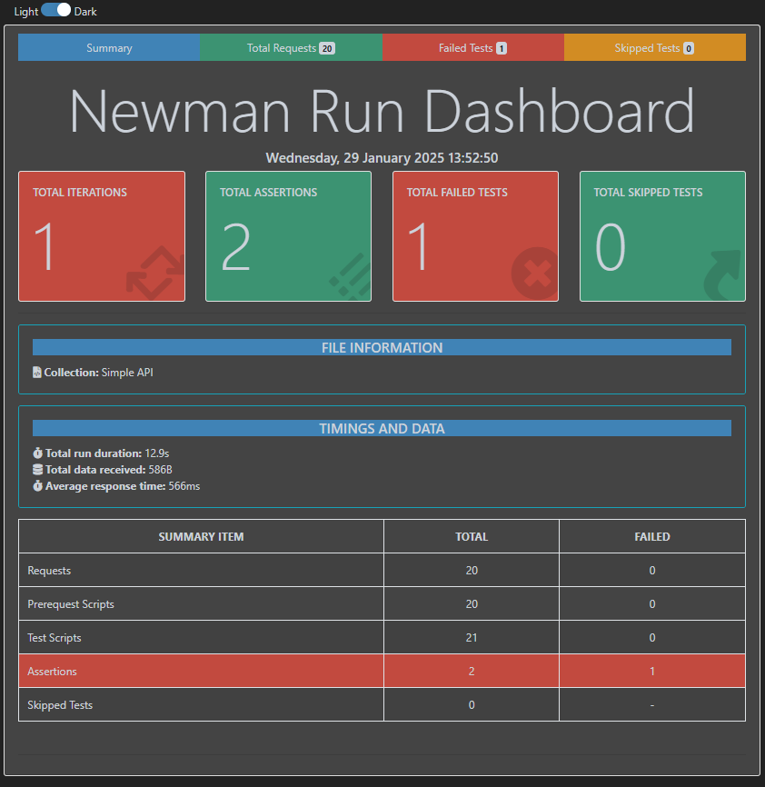

# Simple-Book-API-Test 
## Overview
This project contains API test cases for the Simple Book API, designed and executed using Postman. The test suite covers various API functionalities such as retrieving books, placing orders, updating orders, and deleting them. The collection includes automated test scripts to validate API responses and ensure expected behavior.

## Project Structure
Simple API.postman_collection.json → Postman collection containing all API requests and automated test scripts.
## Technology Used
1. Postman.
2. JavaScript.
3. RESTful APIs.
4. JSON.
## How to Run the Project
**1. Download and install Postman**

**2. Clone the Repository**

`git clone https://github.com/Imratul/Simple-Book-API-Test.git`

`cd Simple-Book-API-Test`

**3. Import Postman Collection**

 - Open Postman.
   
 - Click on Import → Select `Simple API.postman_collection.json.`
   
**4. Set Up Environment**

 - Create a new Postman environment.
   
 - Add the variable baseUrl with the value:
   
   ` https://simple-books-api.glitch.me `
   
**5. Run API Requests**
  
 - Manually send requests from the Postman Collection.

**6. Run Automated Tests**

 - Open the collection in Postman.
 
 - click on Run Collection.
   
 - Review test results in the Postman Test Runner.
   
## API Endpoints Covered
✅ Basic API Functionality
 -  GET /status → Check API status with validation for a 200 response.

✅ Book Retrieval
 -  GET /books → Fetch all books.
 -  GET /books/{bookId} → Get details of a single book.
 -  GET /books/{bookId} (Failed case) → Test with an invalid book ID.
 -  GET /books?type={bookType} → Fetch books by category.

✅ Order Management
 -  POST /orders → Place an order.
 -  POST /orders (Failed case) → Order an unavailable book.
 -  PATCH /orders/{orderId} → Update an order (e.g., change customer name).
 -  PATCH /orders/{orderId} (Failed case) → Attempt an invalid order update.
 -  DELETE /orders/{orderId} → Cancel an order.
 -  DELETE /orders/{orderId} (Failed case) → Try to delete an invalid order.

✅ API Automation Tests
 -  Validate status codes (e.g., expect 200 OK).
 -  Verify JSON responses (e.g., check for status: OK).
 -  Ensure correct error handling (e.g., failed orders return expected messages).
## Newmen Summary Report

